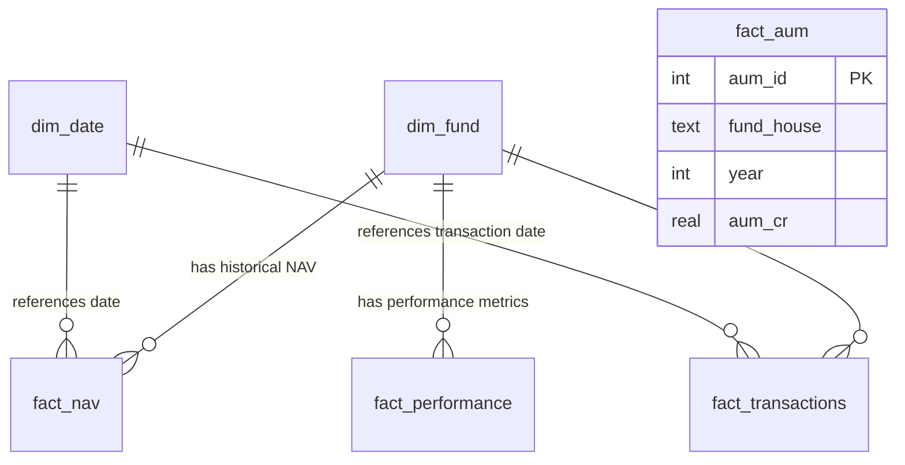

# Bluestock Mutual Fund Analytics Data Dictionary

This data dictionary documents the SQLite star schema database (`bluestock_mf.db`) created for Day 2 of the Bluestock Internship. It defines the tables, column types, keys, constraints, and business logic applied during the cleaning and transformation process.

---

## 1. Database Schema Overview

The database is designed as a **Star Schema** to optimize analytical query performance:
* **Dimension Tables**: `dim_fund`, `dim_date`
* **Fact Tables**: `fact_nav`, `fact_transactions`, `fact_performance`, `fact_aum`

---

## 2. Table Specifications

### 2.1. Table: `dim_fund`
* **Description**: Dimension table containing static metadata for each mutual fund scheme.
* **Source Reference**: `data/raw/fund_master.csv`

| Column Name | Data Type | Key/Constraint | Business Definition | Cleaning & Transformation Rules |
|---|---|---|---|---|
| `scheme_code` | INTEGER | PRIMARY KEY | The unique AMFI (Association of Mutual Funds in India) code for the scheme. | Coerced to non-null 64-bit integer. Deduplicated to ensure uniqueness. |
| `scheme_name` | TEXT | NOT NULL | The official name of the mutual fund scheme. | Stripped of leading/trailing whitespace. |
| `fund_house` | TEXT | NOT NULL | The Asset Management Company (AMC) managing the fund. | Stripped of whitespace. |
| `category` | TEXT | NOT NULL | The asset class category (e.g., Equity, Debt, Hybrid). | Missing values imputed with `"Equity"`. |
| `sub_category` | TEXT | - | Detailed sub-category classification (e.g., Large Cap, Liquid). | Retained raw values. |
| `risk_grade` | TEXT | - | The risk grade assigned to the fund (e.g., Very High, Moderate). | Missing values imputed with `"Very High"`. |

---

### 2.2. Table: `dim_date`
* **Description**: Dimension table representing time, helping group and slice data by months, quarters, years, etc.
* **Source Reference**: Programmatically generated from unique dates in NAV history and transaction tables.

| Column Name | Data Type | Key/Constraint | Business Definition | Cleaning & Transformation Rules |
|---|---|---|---|---|
| `date` | TEXT | PRIMARY KEY | Date in `YYYY-MM-DD` format. | Derived and standardized from all transactional/NAV date events. |
| `day` | INTEGER | NOT NULL | Day of the month (1 - 31). | Extracted from date. |
| `month` | INTEGER | NOT NULL | Month of the year (1 - 12). | Extracted from date. |
| `year` | INTEGER | NOT NULL | Calendar year. | Extracted from date. |
| `quarter` | INTEGER | NOT NULL | Financial quarter (1 - 4). | Extracted from date. |
| `day_of_week` | TEXT | NOT NULL | Name of the day (e.g., Monday, Sunday). | Extracted from date using day name formatting. |

---

### 2.3. Table: `fact_nav`
* **Description**: Fact table containing daily Net Asset Values (NAV) for all schemes.
* **Source Reference**: `data/raw/nav_history.csv` + 6 scheme-specific NAV CSV files.

| Column Name | Data Type | Key/Constraint | Business Definition | Cleaning & Transformation Rules |
|---|---|---|---|---|
| `nav_id` | INTEGER | PRIMARY KEY AUTOINCREMENT | Surrogate primary key for table. | Auto-generated. |
| `amfi_code` | INTEGER | FOREIGN KEY (`dim_fund.scheme_code`) | The scheme code identifying the fund. | Standardized column name from `scheme_code` to `amfi_code`. |
| `date` | TEXT | FOREIGN KEY (`dim_date.date`) | The calendar date of the NAV entry. | Standardized to `YYYY-MM-DD`. |
| `nav` | REAL | NOT NULL | Net Asset Value per unit of the scheme on that date. | Coerced to numeric. Validated `nav > 0`. Weekends/holidays forward-filled using `.ffill()` per scheme. |

---

### 2.4. Table: `fact_transactions`
* **Description**: Fact table recording investor purchase and redemption activities.
* **Source Reference**: `data/raw/investor_transactions.csv`

| Column Name | Data Type | Key/Constraint | Business Definition | Cleaning & Transformation Rules |
|---|---|---|---|---|
| `transaction_id` | TEXT | PRIMARY KEY | Unique alphanumeric transaction reference code. | Standardized. |
| `investor_id` | INTEGER | NOT NULL | Unique identifier for the investor. | Cast to integer. |
| `amfi_code` | INTEGER | FOREIGN KEY (`dim_fund.scheme_code`) | The scheme code in which the transaction occurred. | Standardized from `scheme_code`. |
| `transaction_type` | TEXT | NOT NULL | Type of investment action. Allowed values: `SIP`, `Lumpsum`, `Redemption`. | Cleaned mixed casing and spelling (e.g., "sip" -> "SIP", "LUMP-SUM"/"PURCHASE" -> "Lumpsum"). |
| `amount` | REAL | NOT NULL | Value of the transaction in INR. | Coerced to float. Transactions with `amount <= 0` or null are discarded as anomalous. |
| `transaction_date` | TEXT | FOREIGN KEY (`dim_date.date`) | Date the transaction occurred. | Standardized mixed date formats (e.g. DD-MM-YYYY, YYYY/MM/DD) to `YYYY-MM-DD`. |
| `kyc_status` | TEXT | NOT NULL | KYC compliance status of the investor. Allowed values: `Yes`, `No`, `Pending`. | Mapped dirty inputs (e.g., "Y" -> "Yes", "no" -> "No", "PENDING" -> "Pending"). |
| `state` | TEXT | NOT NULL | Indian state of the investor. | Standardized text. |

---

### 2.5. Table: `fact_performance`
* **Description**: Fact table containing financial returns and cost metrics for each scheme.
* **Source Reference**: `data/raw/scheme_performance.csv`

| Column Name | Data Type | Key/Constraint | Business Definition | Cleaning & Transformation Rules |
|---|---|---|---|---|
| `performance_id` | INTEGER | PRIMARY KEY AUTOINCREMENT | Surrogate primary key. | Auto-generated. |
| `amfi_code` | INTEGER | FOREIGN KEY (`dim_fund.scheme_code`) | The scheme code identifying the fund. | Standardized from `scheme_code`. |
| `cagr_3yr` | REAL | - | Annualized Compound Annual Growth Rate over 3 years. | Coerced to numeric (removed "%" symbols, filled "N/A" with median). |
| `cagr_5yr` | REAL | - | Annualized Compound Annual Growth Rate over 5 years. | Coerced to numeric (removed "%" symbols, filled "N/A" with median). |
| `expense_ratio` | REAL | NOT NULL | Annual operating expenses of the fund as a percentage of assets. | Validated range `0.1% – 2.5%`. Out-of-bounds values flagged and clipped to boundaries. |
| `expense_ratio_anomaly` | INTEGER | DEFAULT 0 | Flag indicating an out-of-bounds expense ratio (`1` if anomaly, `0` otherwise). | Added during cleaning pipeline. |
| `return_anomaly` | INTEGER | DEFAULT 0 | Flag indicating an unusual return profile (cagr > 50% or < -20%). | Added during cleaning pipeline. |

---

### 2.6. Table: `fact_aum`
* **Description**: Fact table recording yearly Assets Under Management (AUM) for major fund houses.
* **Source Reference**: Derived from consolidated yearly AUM datasets.

| Column Name | Data Type | Key/Constraint | Business Definition | Cleaning & Transformation Rules |
|---|---|---|---|---|
| `aum_id` | INTEGER | PRIMARY KEY AUTOINCREMENT | Surrogate primary key. | Auto-generated. |
| `fund_house` | TEXT | NOT NULL | Name of the fund house. | Deduplicated and standardized. |
| `year` | INTEGER | NOT NULL | Calendar year of the AUM record. | Cast to integer. |
| `aum_cr` | REAL | NOT NULL | Total Assets Under Management in Crore (INR). | Verified against exact targets (e.g. SBI at 12.5L Cr in 2025). |
